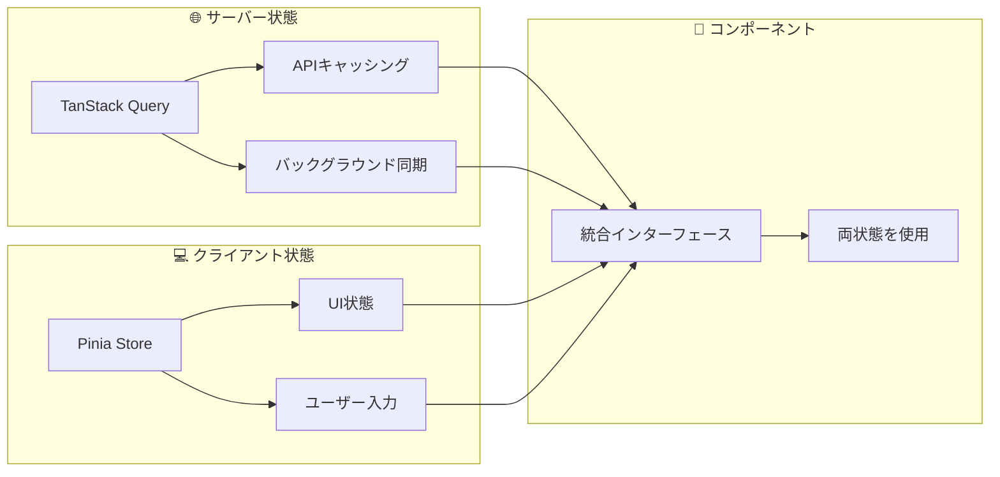

# Nuxt 4 + Hono + TanStack Query フルスタック サンプル

> **モダンなハイブリッド状態管理**を学べるフルスタックアプリケーションサンプル

## 📖 概要

このプロジェクトは **Nuxt 4**、**Hono**、**TanStack Query + Pinia** を組み合わせた学習用のフルスタック開発サンプルです。特に **サーバー状態とクライアント状態を明確に分離**したハイブリッド設計が特徴で、モダンなフロントエンド開発手法を学習できます。

## ✨ 主な特徴

- 🏗️ **ハイブリッド状態管理**: TanStack Query（サーバー状態）+ Pinia（クライアント状態）
- 🔗 **API-First開発**: OpenAPI仕様からTypeScript型定義を自動生成
- ⚡ **エッジランタイム対応**: Honoによる高性能API
- 🎯 **型安全**: フロント・バック間の完全な型安全性
- 🧪 **テスト準備済み**: テストフレームワークとヘルパー関数を準備

## 🛠️ 技術スタック

| 分野                 | 技術                      | 用途                                 |
| -------------------- | ------------------------- | ------------------------------------ |
| **フロントエンド**   | Nuxt 4 + Vue 3            | フルスタックフレームワーク           |
| **サーバー状態**     | TanStack Query            | API データ・キャッシング・同期       |
| **クライアント状態** | Pinia                     | UI状態・ユーザー入力・ローカルデータ |
| **バックエンド**     | Hono + OpenAPI            | 高性能API・自動ドキュメント生成      |
| **型安全性**         | TypeScript + Zod          | コンパイル時・ランタイム検証         |
| **開発ツール**       | Biome + ESLint + Prettier | コード品質管理                       |

## 🚀 クイックスタート

### 前提条件

- Node.js v22.16.0+ / pnpm v10.15.1+

### セットアップ

```bash
# クローン・インストール・起動
git clone <repository-url>
cd nuxt-frontend-architect-sample
pnpm install
pnpm dev
```

### アクセス

- **アプリ**: http://localhost:3000
- **API ドキュメント**: http://localhost:3000/api/swagger
- **OpenAPI仕様**: http://localhost:3000/api/openapi.yaml
- **型定義生成**: `pnpm generate-types` （完全自動化対応）

## 🚀 型定義の自動生成（NEW!）

このプロジェクトでは、型定義生成プロセスが**完全自動化**されています：

```bash
# 1コマンドで全て完了
pnpm generate-types
```

**🔄 自動化されたワークフロー**:
1. 開発サーバーを自動起動
2. サーバー準備完了を検知
3. OpenAPIスペックを取得
4. サーバーを自動停止
5. TypeScript型定義を生成
6. コードを自動整形

**📋 利用可能なコマンド**:
- `pnpm generate-types` - 完全自動化（推奨）
- `pnpm generate-types:manual` - 従来の手動方式
- `pnpm generate-types:ci` - CI専用（既存ファイル前提）

## 📚 学習パス

### 🔰 初学者向け

1. **[クイックスタート](./docs/quickstart.md)** - 環境構築・基本操作
2. **[アーキテクチャ概要](./docs/architecture.md)** - 設計思想・全体像の理解

### ⚡ 実践者向け

3. **[ハイブリッド状態管理](./docs/state-management.md)** - TanStack Query + Pinia
4. **[API-First統合](./docs/api-integration.md)** - OpenAPI・型生成・実装パターン
5. **[開発ワークフロー](./docs/development.md)** - 効率的な開発手法

### 🎯 上級者向け

6. **[テスト戦略](./docs/testing.md)** - 両状態管理のテスト手法
7. **[本番デプロイ](./docs/deployment.md)** - SSG・SSR・最適化
8. **[トラブルシューティング](./docs/troubleshooting.md)** - 問題解決・デバッグ

## 🏗️ アーキテクチャハイライト

### ハイブリッド状態管理



### データフロー

```typescript
// 統合された使いやすいインターフェース
const {
  isLoading, // TanStack Query から
  healthStatusData, // TanStack Query から
  sampleInput, // Pinia から
} = useHealth();
```

## 📁 プロジェクト構造

```
├── app/                    # Nuxt アプリケーション
│   ├── store/             # Pinia ストア（クライアント状態）
│   ├── queries/           # TanStack Query（サーバー状態）
│   ├── composables/       # 統合アダプター層
│   ├── services/          # API 通信層
│   └── components/        # Vue コンポーネント
├── server/api/            # Hono バックエンド
├── shared/types/api/      # 自動生成型定義
├── docs/                  # 詳細ドキュメント
└── tests/                 # テストファイル
```

## ⚡ 開発コマンド

```bash
# 開発
pnpm dev              # 開発サーバー
pnpm generate-types   # API型定義生成

# 品質管理
pnpm lint            # リント・型チェック
pnpm test            # テスト実行

# ビルド
pnpm build           # プロダクションビルド
pnpm generate        # 静的サイト生成
```

## 🎯 このプロジェクトで学べること

- **🏗️ モダンなアーキテクチャ**: 学習しやすい設計パターン
- **⚖️ 状態管理の分離**: サーバー・クライアント状態の適切な責任分割
- **🔄 API-First開発**: スキーマ駆動開発の実践
- **🧪 テストの基礎**: 状態管理システムのテスト入門
- **⚡ モダンツールチェーン**: 最新の開発ツールの効果的活用

## 🤝 コントリビューション

改善提案やバグ報告は Issue・Pull Request でお気軽にどうぞ。

## 📖 詳細ドキュメント

各トピックの詳細は [docs](./docs/) ディレクトリをご覧ください：

- 📚 学習ガイド・実装例
- 🛠️ 開発ワークフロー・ベストプラクティス
- 🧪 テスト戦略・トラブルシューティング
- 🚀 デプロイメント・本番運用

---

**🚀 今すぐ始める**: [`docs/quickstart.md`](./docs/quickstart.md)
