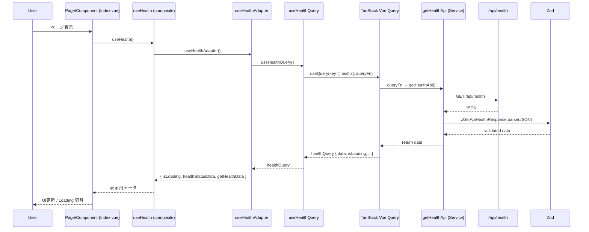

# Nuxt 4 + Hono + TanStack Query フルスタック サンプル

## 📖 プロジェクト概要

このプロジェクトは、**Nuxt 4**、**Hono**、**TanStack Query** を組み合わせたモダンなフルスタックWeb開発のサンプルプロジェクトです。初学者から上級者まで、最新の技術スタックを使ったプロダクションレベルの開発手法を学べる構成になっています。

### 🎯 このプロジェクトで学べること

- **Nuxt 4** でのフルスタックWebアプリケーション開発
- **Hono** による高性能なAPI開発とOpenAPI統合
- **TanStack Query** を使った効率的なデータフェッチング・キャッシング
- **TypeScript** による完全な型安全性の実現
- **API-First開発** の実践（OpenAPI + Zod）
- **モダンな開発ツールチェーン** の活用

### 🛠️ 技術スタック

#### フロントエンド

- **[Nuxt 4](https://nuxt.com/)** - フルスタックVue.jsフレームワーク
- **[Vue 3](https://vuejs.org/)** - プログレッシブJavaScriptフレームワーク
- **[TanStack Query](https://tanstack.com/query)** - 強力なデータ同期・キャッシングライブラリ
- **[TypeScript](https://www.typescriptlang.org/)** - 型安全な開発
- **[Tailwind CSS](https://tailwindcss.com/)** - ユーティリティファーストCSSフレームワーク
- **[Pinia](https://pinia.vuejs.org/)** - Vue 3向けクライアント状態管理ライブラリ（UI状態、ユーザー設定用）

#### バックエンド

- **[Hono](https://hono.dev/)** - エッジランタイム対応高性能Webフレームワーク
- **[Zod](https://zod.dev/)** - TypeScript向けスキーマ検証ライブラリ
- **[OpenAPI](https://www.openapis.org/)** - API仕様書の自動生成とSwagger UI

#### 開発ツール

- **[Biome](https://biomejs.dev/)** - 高速リンター・フォーマッター
- **[ESLint](https://eslint.org/)** - JavaScript/TypeScript静的解析ツール
- **[Prettier](https://prettier.io/)** - コードフォーマッター
- **[@hey-api/openapi-ts](https://github.com/hey-api/openapi-ts)** - TypeScript型定義自動生成

### 🏗️ アーキテクチャの特徴

- **モノレポ構成**: フロントエンド、バックエンド、共有型定義を統合管理
- **API-First開発**: OpenAPI仕様からTypeScript型定義を自動生成
- **型安全な通信**: フロントエンド⇔バックエンド間の完全な型安全性
- **効率的なデータ管理**: TanStack Queryによるサーバー状態管理・SSR対応キャッシング・同期機能
- **高性能API**: Honoによるエッジランタイム対応の軽量で高速なAPI
- **コンポーザブル設計**: 再利用可能なロジックの分離
- **モダンツールチェーン**: 開発効率を最大化する最新ツール

#### アーキテクチャシーケンス図



## 🚀 クイックスタート

### 前提条件

以下の環境が必要です：

- **Node.js** v24.7.0 以上
- **pnpm** v10.15.0 以上（推奨）

> このプロジェクトでは[Volta](https://volta.sh/)で Node.js と pnpm のバージョン管理をしています。

### セットアップ

1. **リポジトリをクローン**

   ```bash
   git clone <repository-url>
   cd nuxt-frontend-architect-sample
   ```

2. **依存関係をインストール**

   ```bash
   pnpm install
   ```

3. **開発サーバーを起動**

   ```bash
   pnpm dev
   ```

4. **ブラウザでアクセス**
   - アプリケーション: http://localhost:3000
   - API ドキュメント: http://localhost:3000/api/swagger
   - OpenAPI 仕様: http://localhost:3000/api/openapi.yaml

## 📁 プロジェクト構造

```
├── app/                           # Nuxtアプリケーション
│   ├── components/                # Vueコンポーネント
│   │   └── index/                 # インデックスページ用コンポーネント
│   ├── composables/               # 再利用可能なコンポジション関数（アダプター）
│   │   ├── common/                # 共通ユーティリティ
│   │   └── useHealth/             # ヘルスチェック機能アダプター
│   ├── queries/                   # TanStack Query層
│   │   └── useHealthQuery.ts      # ヘルスチェック用クエリ
│   ├── layouts/                   # ページレイアウト
│   ├── pages/                     # ルートページ (ファイルベースルーティング)
│   ├── services/                  # API通信・ビジネスロジック
│   ├── plugins/                   # Nuxtプラグイン (TanStack Query設定)
│   ├── helpers/test/              # テストヘルパー
│   ├── types/                     # 型定義
│   └── assets/css/                # スタイルシート
├── server/                        # バックエンドAPI
│   └── api/
│       ├── routes/                # API ルートハンドラー
│       └── schema/                # Zodスキーマ定義
├── shared/                        # 共有リソース
│   └── types/api/                 # 自動生成された型定義とZodスキーマ
└── public/                        # 静的ファイル
```

### 主要ファイルの役割

| ファイル               | 役割                                   |
| ---------------------- | -------------------------------------- |
| `nuxt.config.ts`       | Nuxtの設定ファイル                     |
| `package.json`         | プロジェクトの依存関係と実行スクリプト |
| `openapi-ts.config.ts` | TypeScript型定義の自動生成設定         |
| `app.vue`              | アプリケーションのルートコンポーネント |

## ⚡ よく使うコマンド

### 開発コマンド

```bash
# 開発サーバー起動
pnpm dev

# プロダクション用ビルド
pnpm build

# プロダクションビルドのプレビュー
pnpm preview

# 静的サイト生成
pnpm generate
```

### コード品質管理

```bash
# すべてのリント・型チェック実行
pnpm lint

# 自動修正付きリント実行
pnpm lint:fix

# 型チェックのみ実行
pnpm typecheck
```

### API型定義の生成

```bash
# 開発環境を立ち上げる
pnpm dev
# OpenAPIからTypeScript型定義を生成
pnpm generate-types
```

## 🔧 API型定義・Zodスキーマ・TanStack Queryの使い方

このプロジェクトでは、[openapi-ts](https://github.com/hey-api/openapi-ts)による型定義自動生成、Zodスキーマ検証、TanStack Queryによる効率的なデータフェッチングを統合的に活用しています。

### 概要

- **APIスキーマから TypeScript の型定義と Zod スキーマを自動生成**
- **TanStack Query によるキャッシング・データ同期**
- 生成されたファイルは `shared/types/api/` ディレクトリに配置
- フロントエンドでの API レスポンスの型安全性とランタイムバリデーションを提供
- **SSR/SSG 対応のデータハイドレーション**

### 生成されるファイル

```
shared/types/api/
├── index.ts       # エクスポート用のインデックスファイル
├── types.gen.ts   # TypeScript型定義
└── zod.gen.ts     # Zodスキーマ定義
```

### 使用例

#### 1. サービス層でのAPI通信とバリデーション（現在の実装）

```typescript
// app/services/health.ts
import { type GetApiHealthResponse, zGetApiHealthResponse } from '#shared/types/api';

export const getHealthApi = async (): Promise<GetApiHealthResponse> => {
  const response = await $fetch<GetApiHealthResponse>('/api/health', {
    method: 'GET',
  });
  return zGetApiHealthResponse.parse(response); // Zodバリデーション
};
```

#### 2. データフローの仕組み（現在の実装）

このプロジェクトでは、**API→コンポーネント**へのデータの流れを4つの層に分けて整理しています。

**🔍 なぜ分ける？**

- 各層の責任がはっきりする
- 問題の原因を特定しやすい
- コードの再利用がしやすい
- テストが書きやすくなる

**📋 データの流れ**

1. **API通信** (`app/services/`) - HTTPリクエスト＋データ検証
2. **データ取得** (`app/queries/`) - TanStack Queryでキャッシングと状態管理
3. **データ整形** (`app/composables/`) - 画面表示用にデータを加工
4. **表示** (コンポーネント) - 整形されたデータを表示

```typescript
// 1️⃣ API通信 (app/services/health.ts)
// HTTP通信とZodによるデータ検証
export const getHealthApi = async (): Promise<GetApiHealthResponse> => {
  const response = await $fetch<GetApiHealthResponse>('/api/health', {
    method: 'GET',
  });
  return zGetApiHealthResponse.parse(response); // データ検証
};

// 2️⃣ データ取得 (app/queries/useHealthQuery.ts)
// TanStack Queryでキャッシングと再取得の管理
export const useHealthQuery = () => {
  const healthQuery = useQuery({
    queryKey: ['health'] as const,
    queryFn: getHealthApi, // ①で定義した関数を使用
  });
  return { healthQuery };
};

// 3️⃣ データ整形 (app/composables/useHealth/useHealthAdapter.ts)
// APIデータを画面表示用に変換
export const useHealthAdapter = () => {
  const { healthQuery } = useHealthQuery(); // ②から受け取り
  const { isLoading, data, suspense: getHealthData } = healthQuery;

  // 画面表示用にデータを整形
  const healthStatusData = computed(() => ({
    healthStatus: data.value?.status ?? '-', // 生データを表示用に変換
    healthTimestamp: data.value?.timestamp ?? '-',
  }));

  return { isLoading, healthStatusData, getHealthData };
};

// 4️⃣ コンポーネント用の入り口 (app/composables/useHealth/index.ts)
export const useHealth = () => {
  return {
    ...useHealthAdapter(), // ③で整形されたデータを提供
  };
};
```

#### 3. コンポーネントでの使用例（現在の実装）

```vue
<!-- app/pages/index.vue -->
<script setup lang="ts">
import Index from '@/components/index/Index.vue';
import { useRenderEnvironment } from '@/composables/common/useRenderEnvironment';
import { useHealth } from '@/composables/useHealth';

const indexPageId = useId();
const { isInitialClientRender } = useRenderEnvironment();
const { getHealthData } = useHealth();

const handleInit = async () => {
  if (isInitialClientRender.value) {
    return;
  }
  await getHealthData();
};

await handleInit();
</script>

<template>
  <section :id="indexPageId">
    <Index />
  </section>
</template>
```

```vue
<!-- app/components/index/Index.vue -->
<script setup lang="ts">
import { useHealth } from '@/composables/useHealth';
import HealthStatusDisplayArea from './HealthStatusDisplayArea.vue';
import Title from './Title.vue';

const greetingMessage = 'Hello, Frontend Architect Sample!';
const { isLoading, healthStatusData } = useHealth();
</script>

<template>
  <div>
    <Title :title="greetingMessage" />
    <template v-if="isLoading">
      <p>Loading...</p>
    </template>
    <template v-else>
      <HealthStatusDisplayArea v-bind="healthStatusData" />
    </template>
  </div>
</template>
```

```vue
<!-- app/components/index/HealthStatusDisplayArea.vue -->
<script setup lang="ts">
import type { HealthStatusData } from '@/composables/useHealth/useHealthAdapter';

type Props = HealthStatusData;
defineProps<Props>();
</script>

<template>
  <ul>
    <li>status: {{ healthStatus }}</li>
    <li>timestamp: {{ healthTimestamp }}</li>
  </ul>
</template>
```

#### 4. この構成の利点

**🎯 各層の責任がはっきり分かれている**

```typescript
// ❌ もしも全部まとめて書いたら...
const useHealth = () => {
  // HTTP通信、エラーハンドリング、キャッシング、データ変換が混在
  // 100行を超える複雑なコードになる😵
};

// ✅ 実際の実装: 責任ごとに4層に分離
const getHealthApi = () => $fetch('/api/health'); // HTTP通信だけ
const useHealthQuery = () => useQuery({ queryFn: getHealthApi }); // キャッシング管理だけ
const useHealthAdapter = () => ({ healthStatusData }); // データ変換だけ
const useHealth = () => useHealthAdapter(); // 最終的な窓口
```

**📈 こんな良いことがある**

- **問題を見つけやすい**:
  - 「通信エラー」→ `services/` を確認
  - 「キャッシュの問題」→ `queries/` を確認
  - 「表示データの問題」→ `composables/` を確認
- **使い回しやすい**: `getHealthApi` や `useHealthQuery` は別の画面でも使える
- **テストしやすい**: 各層を個別にテストできる
- **拡張しやすい**: 新しいAPI追加は各フォルダにファイルを1つずつ追加するだけ

**💡 現在のシンプル構成**

現在はPiniaストア（クライアント状態管理）は使わず、TanStack Queryだけでデータ管理をしています。
UI状態（ダークモード等）が必要になったらPiniaを追加予定です。

### このプロジェクトのデータ管理の仕組み

このプロジェクトでは、**4層に分けたデータの流れ**で整理されています：

**🌐 API通信層（`app/services/`）**

- HTTPリクエストの実行
- レスポンスデータの検証（Zod使用）
- エラーハンドリングの基礎部分

**📦 データ取得層（`app/queries/`）**

- TanStack Queryによるデータキャッシング
- バックグラウンド更新の管理
- ローディング状態やエラー状態の提供

**🔄 データ変換層（`app/composables/`）**

- APIデータを画面表示用に変換
- コンポーネントが使いやすい形にデータを整形
- ビジネスロジックの実装

**🖼️ 表示層（components）**

- 整形されたデータを受け取って表示
- ユーザーインタラクションの処理

**💡 将来の拡張予定**

現在はTanStack Queryだけでデータ管理していますが、UI状態（ダークモード等）が必要になったらPinia（クライアント状態管理）を追加予定です。

### TanStack Query の設定

プロジェクトでは `app/plugins/vue-query.ts` で TanStack Query を設定しています：

```typescript
// app/plugins/vue-query.ts
import { QueryClient, VueQueryPlugin } from '@tanstack/vue-query';

const queryClient = new QueryClient({
  defaultOptions: {
    queries: {
      staleTime: 1000 * 60 * 5, // 5分間キャッシュ
      gcTime: 1000 * 60 * 30, // 30分間メモリに保持
      refetchOnWindowFocus: false,
      refetchOnMount: true,
      retry: 1,
    },
  },
});
```

**主な特徴：**

- **SSR対応**: サーバー側でフェッチしたデータをクライアント側でハイドレーション
- **自動キャッシング**: 5分間のデータキャッシュで効率的なデータ取得
- **バックグラウンド更新**: データの自動同期とリフレッシュ

### スキーマの再生成

APIスキーマが更新された場合は、以下のコマンドで型定義を再生成できます：

```bash
pnpm dev
# 別ターミナルで実行
pnpm generate-types
```

## 🎨 Nuxt 4 の基本的な使い方

### ページの追加

ファイルベースルーティングを使用しているため、`app/pages/` にVueファイルを追加するだけで新しいページを作成できます。

```vue
<!-- app/pages/about.vue -->
<template>
  <div>
    <h1>About Page</h1>
    <p>このページについて説明します。</p>
  </div>
</template>
```

上記のファイルを作成すると、`http://localhost:3000/about` でアクセスできるようになります。

### コンポーネントの作成

`app/components/` ディレクトリにコンポーネントを作成すると、自動的にインポートされて使用できます。

```vue
<!-- app/components/HelloWorld.vue -->
<template>
  <div class="hello">
    <h2>{{ message }}</h2>
  </div>
</template>

<script setup lang="ts">
interface Props {
  message: string;
}

defineProps<Props>();
</script>
```

```vue
<!-- app/pages/index.vue -->
<template>
  <div>
    <HelloWorld message="こんにちは、Nuxt 4！" />
  </div>
</template>
```

### コンポーザブルの使用

`app/composables/` ディレクトリに作成したコンポーザブルは、自動的にインポートされます。

```typescript
// app/composables/useCounter.ts
export const useCounter = () => {
  const count = ref(0);

  const increment = () => {
    count.value++;
  };

  const decrement = () => {
    count.value--;
  };

  return {
    count: readonly(count),
    increment,
    decrement,
  };
};
```

```vue
<!-- ページやコンポーネントで使用 -->
<template>
  <div>
    <p>カウント: {{ count }}</p>
    <button @click="increment">+1</button>
    <button @click="decrement">-1</button>
  </div>
</template>

<script setup lang="ts">
const { count, increment, decrement } = useCounter();
</script>
```

## 🛠️ 開発フロー

### 1. 新機能の開発手順

1. **ブランチの作成**

   ```bash
   git checkout -b feature/new-feature
   ```

2. **API仕様の定義** (必要な場合)
   - `server/api/schema/` でZodスキーマを定義
   - `server/api/routes/` でAPIエンドポイントを実装

3. **型定義の生成**

   ```bash
   pnpm generate-types
   ```

4. **フロントエンドの実装**
   - Services → Store → Components の順で実装
   - コンポーザブルで再利用可能なロジックを分離

5. **コード品質チェック**
   ```bash
   pnpm lint
   ```

### 2. デバッグ手法

- **Nuxt DevTools**: ブラウザ内でコンポーネント構造や状態を確認
- **Vue DevTools**: Vue.js専用のブラウザ拡張機能
- **コンソールログ**: `console.log()` を使ったシンプルなデバッグ
- **型エラー確認**: `pnpm typecheck` でTypeScriptエラーを早期発見

## 🚨 トラブルシューティング

### よくある問題と解決方法

#### 1. 開発サーバーが起動しない

```bash
# ポートが既に使用されている場合
pnpm dev --port 3001

# node_modules を再インストール
rm -rf node_modules pnpm-lock.yaml
pnpm install
```

#### 2. 型エラーが発生する

```bash
# 型定義を再生成
pnpm generate-types

# TypeScript型チェック実行
pnpm typecheck
```

#### 3. ESLint/Prettier エラー

```bash
# 自動修正を実行
pnpm lint:fix

# 個別に修正
pnpm eslint:fix
pnpm biome:fix
pnpm prettier:fix
```

#### 4. ホットリロードが動作しない

- ブラウザのキャッシュをクリア
- 開発サーバーを再起動: `Ctrl+C` → `pnpm dev`

## 📚 参考リンク

### フレームワーク・ライブラリ

- [Nuxt 4 公式ドキュメント](https://nuxt.com/docs)
- [Hono 公式ドキュメント](https://hono.dev/)
- [TanStack Query 公式ドキュメント](https://tanstack.com/query/latest/docs/framework/vue/overview)
- [Vue 3 公式ドキュメント](https://vuejs.org/guide/)
- [TypeScript 公式ドキュメント](https://www.typescriptlang.org/docs/)

### スタイリング・状態管理

- [Tailwind CSS 公式ドキュメント](https://tailwindcss.com/docs)
- [Pinia 公式ドキュメント](https://pinia.vuejs.org/)

### API・スキーマ

- [Zod 公式ドキュメント](https://zod.dev/)
- [OpenAPI Specification](https://swagger.io/specification/)
- [@hey-api/openapi-ts](https://github.com/hey-api/openapi-ts)

## 🤝 コントリビューション

1. このリポジトリをフォーク
2. 機能ブランチを作成 (`git checkout -b feature/AmazingFeature`)
3. コミット (`git commit -m 'Add some AmazingFeature'`)
4. ブランチにプッシュ (`git push origin feature/AmazingFeature`)
5. プルリクエストを作成

---

## MCP Setup

```bash
claude mcp add playwright npx @playwright/mcp@latest

claude mcp add context7 -- npx --yes @upstash/context7-mcp

claude mcp add serena -- uvx --from git+https://github.com/oraios/serena serena-mcp-server --context ide-assistant --project $(pwd)
```
