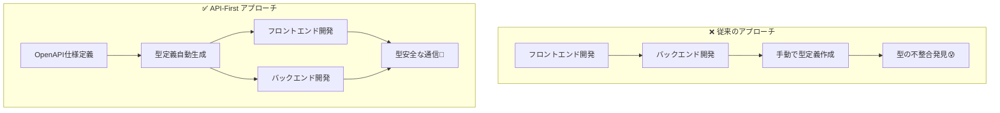

# 🔗 API-First 統合ガイド

初学者向けに、このプロジェクトの **API-First** 開発アプローチについて説明します。

## API-First開発とは？

### 従来のアプローチ vs API-First



### 利点

- **型の一貫性**: フロント・バック間で型定義が自動同期
- **開発効率**: 手動でのインターフェース作成が不要
- **ドキュメント**: Swagger UIによる自動ドキュメント生成

## このプロジェクトのAPI実装

### Health API の定義

このプロジェクトには **Health API** が実装されています：

```typescript
// server/api/schema/health.ts（実際のファイル）
import { z } from '@hono/zod-openapi';

// 成功時のレスポンススキーマ
export const healthResponseSchema = z.object({
  status: z.string().openapi({ example: 'ok' }),
  timestamp: z.iso.datetime().openapi({ example: new Date().toISOString() }),
});

// エラー時のレスポンススキーマ（実践的エラーコード対応）
export const healthErrorSchema = z.object({
  error: z.string().openapi({ example: 'Service temporarily unavailable' }),
  errorCode: z.string().openapi({
    example: 'SVR_002',
    description: 'カスタムエラーコード（NET_xxx: ネットワーク, SVR_xxx: サーバー, UNK_xxx: 不明）',
  }),
  timestamp: z.iso.datetime().openapi({ example: new Date().toISOString() }),
});
```

### API実装

```typescript
// server/api/routes/health.ts（実際のファイル）
import { OpenAPIHono } from '@hono/zod-openapi';
import { healthRoute } from '../schema/health';

const app = new OpenAPIHono();

app.openapi(healthRoute, (c) => {
  return c.json({
    status: 'ok' as const,
    timestamp: new Date().toISOString(),
  });
});

export default app;
```

## 型定義の自動生成

### 設定ファイル

```typescript
// openapi-ts.config.ts
import { defineConfig } from '@hey-api/openapi-ts';

export default defineConfig({
  input: 'http://localhost:3000/api/openapi.yaml',
  output: {
    path: './shared/types/api',
    format: 'prettier',
  },
  types: {
    dates: 'types+transform',
    enums: 'typescript',
  },
  plugins: ['@hey-api/typescript', '@hey-api/zod'],
});
```

### 生成されるファイル

```
shared/types/api/
├── index.ts       # エクスポート用インデックス
├── types.gen.ts   # TypeScript型定義
└── zod.gen.ts     # Zodスキーマ
```

### 型定義生成コマンド

```bash
# 1. 開発サーバーを起動
pnpm dev

# 2. 別ターミナルで型定義生成
pnpm generate-types
```

## 型安全なAPI通信の実装

### サービス層での使用

```typescript
// app/services/health.ts
import { type GetApiHealthResponse, zGetApiHealthResponse } from '#shared/types/api';

export const getHealthApi = async (): Promise<GetApiHealthResponse> => {
  // 1. HTTP通信
  const response = await $fetch<GetApiHealthResponse>('/api/health', {
    method: 'GET',
  });

  // 2. ランタイム検証（Zodスキーマ）
  return zGetApiHealthResponse.parse(response);
};
```

### TanStack Query との統合

```typescript
// app/queries/useHealthQuery.ts
import { useQuery } from '@tanstack/vue-query';
import { getHealthApi } from '~/services/health';

export const useHealthQuery = () => {
  const healthQuery = useQuery({
    queryKey: ['health'] as const,
    queryFn: getHealthApi,
  });

  return { healthQuery };
};
```

### コンポーネントでの使用

```typescript
// app/composables/useHealth/useHealthAdapter.ts
export const useHealthAdapter = () => {
  const { healthQuery } = useHealthQuery();
  const { isLoading, data, suspense: getHealthData } = healthQuery;

  const healthStatusData = computed(() => ({
    healthStatus: data.value?.status ?? '-',
    healthTimestamp: data.value?.timestamp ?? '-',
  }));

  return { isLoading, healthStatusData, getHealthData };
};
```

## API ドキュメントの確認

### Swagger UI へのアクセス

開発サーバー起動後、以下のURLでAPIドキュメントを確認できます：

- **Swagger UI**: http://localhost:3000/api/swagger
- **OpenAPI仕様**: http://localhost:3000/api/openapi.yaml

### API テストの実行

Swagger UI画面で実際にAPIを試すことができます：

1. http://localhost:3000/api/swagger にアクセス
2. Health Check APIを選択
3. 「Try it out」ボタンをクリック
4. 「Execute」ボタンでAPIを実行

## 開発フローの基本

### 新しいAPI追加の手順

1. **スキーマ定義**: `server/api/schema/` でZodスキーマを定義
2. **ルート実装**: `server/api/routes/` でAPIを実装
3. **型定義生成**: `pnpm generate-types` で型を生成
4. **フロントエンド実装**: `app/services/` でAPI通信ロジックを作成

## 学習のポイント

### 🔰 初学者が覚えること

1. **API-First**: 仕様を先に決めてから実装する
2. **型安全性**: TypeScriptで型エラーを防ぐ
3. **自動生成**: 手動作業を減らして効率化

### ⚡ 実践のコツ

- API仕様を変更したら `pnpm generate-types` を忘れずに実行
- Swagger UIでAPIの動作を確認
- Zodスキーマでランタイム検証を活用

## 次のステップ

- 📊 [状態管理](./state-management.md) - TanStack Queryとの連携
- 🧪 [テスト](./testing.md) - APIテストの基本
- 💻 [開発ワークフロー](./development.md) - 効率的な開発手法
