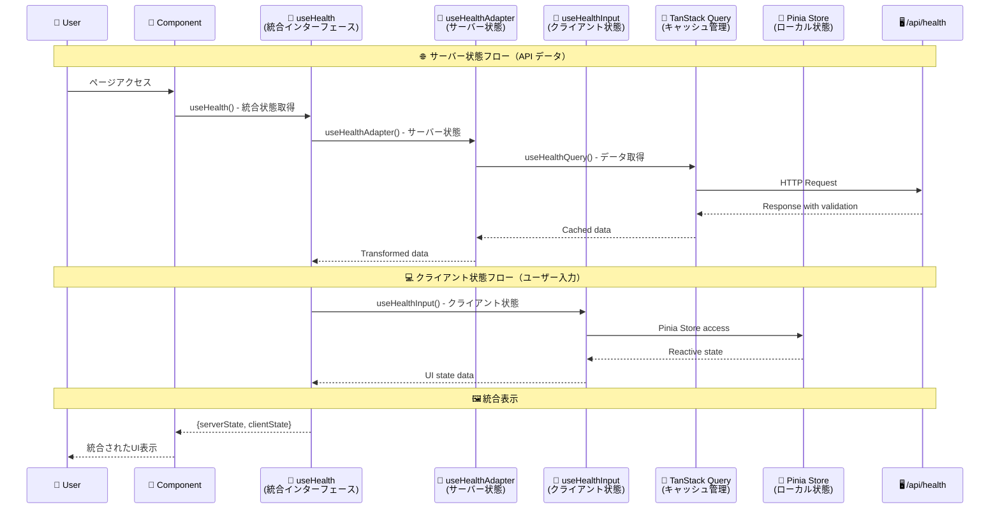
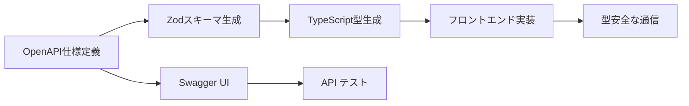

# 🏗️ アーキテクチャガイド

このドキュメントでは、プロジェクトのアーキテクチャ設計とハイブリッド状態管理の仕組みについて詳しく説明します。

## アーキテクチャの特徴

### モノレポ構成

- **フロントエンド、バックエンド、共有型定義を統合管理**
- **API-First開発**: OpenAPI仕様からTypeScript型定義を自動生成
- **型安全な通信**: フロントエンド⇔バックエンド間の完全な型安全性

### ハイブリッド状態管理

このプロジェクトの最大の特徴は、**サーバー状態とクライアント状態を明確に分離**したハイブリッド設計です：

- **TanStack Query**: サーバー状態（API データ、キャッシング、同期）
- **Pinia**: クライアント状態（ユーザー入力、UI状態、ローカルデータ）

## アーキテクチャ概要図



## 状態管理アーキテクチャ

### サーバー状態管理（TanStack Query）

**責任範囲**: API データ、キャッシング、バックグラウンド同期

```
📡 API通信 → 🗄️ クエリ管理 → 🔄 データ変換 → 🎨 コンポーネント
   ↓              ↓               ↓
services/      queries/     composables/
```

#### 1. API通信層 (`app/services/`)

```typescript
// HTTP通信とZodによるデータ検証
export const getHealthApi = async (): Promise<GetApiHealthResponse> => {
  const response = await $fetch<GetApiHealthResponse>('/api/health');
  return zGetApiHealthResponse.parse(response); // ランタイム検証
};
```

#### 2. クエリ層 (`app/queries/`)

```typescript
// TanStack Queryでキャッシングと状態管理
export const useHealthQuery = () => {
  const healthQuery = useQuery({
    queryKey: ['health'] as const,
    queryFn: getHealthApi, // サービス層を使用
  });
  return { healthQuery };
};
```

#### 3. アダプター層 (`app/composables/`)

```typescript
// APIデータを画面表示用に変換
export const useHealthAdapter = () => {
  const { healthQuery } = useHealthQuery();
  const { isLoading, data, suspense: getHealthData } = healthQuery;

  // 表示用データ変換
  const healthStatusData = computed(() => ({
    healthStatus: data.value?.status ?? '-',
    healthTimestamp: data.value?.timestamp ?? '-',
  }));

  return { isLoading, healthStatusData, getHealthData };
};
```

### クライアント状態管理（Pinia）

**責任範囲**: ユーザー入力、UI状態、ローカルデータ

```
🏪 ストア定義 → 🔧 ストア操作 → 🎨 コンポーネント
     ↓              ↓
   store/      composables/
```

#### 1. ストア層 (`app/store/`)

```typescript
// Composition API スタイルのストア定義
export const useHealthStore = defineStore('health', () => {
  const input = ref('');
  const updateInput = (value: string): void => {
    input.value = value;
  };
  return { input, updateInput };
});
```

#### 2. ストア操作層 (`app/composables/`)

```typescript
// ストアアクセスとデータ変換
export const useHealthInput = () => {
  const healthStore = useHealthStore();
  const { input } = storeToRefs(healthStore);
  const { updateInput } = healthStore;

  // v-model対応のcomputed
  const sampleInput = computed({
    get: () => input.value,
    set: (value: string) => updateInput(value),
  });

  return { sampleInput };
};
```

### 統合インターフェース

```typescript
// app/composables/useHealth/index.ts
export const useHealth = () => {
  return {
    ...useHealthAdapter(), // サーバー状態（API データ）
    ...useHealthInput(), // クライアント状態（ユーザー入力）
  };
};
```

## コンポーネントアーキテクチャ

### 統合状態の使用

```vue
<!-- app/components/index/Index.vue -->
<script setup lang="ts">
const {
  isLoading, // TanStack Query から
  healthStatusData, // TanStack Query から
  sampleInput, // Pinia から
} = useHealth();
</script>

<template>
  <div>
    <template v-if="isLoading">Loading...</template>
    <template v-else>
      <!-- サーバー状態の表示 -->
      <HealthStatusDisplayArea v-bind="healthStatusData" />
      <!-- クライアント状態（ユーザー入力） -->
      <Input v-model:sample-input.lazy="sampleInput" />
    </template>
  </div>
</template>
```

## この設計の利点

### 🎯 明確な責任分離

```typescript
// ❌ 従来のアプローチ: 全部混在
const useEverything = () => {
  // HTTP通信、キャッシング、ユーザー入力、データ変換が混在
  // 150行を超える複雑なコード😵
};

// ✅ ハイブリッドアプローチ: 責任ごとに分離
const getHealthApi = () => {
  /* HTTP通信だけ */
};
const useHealthQuery = () => {
  /* キャッシングだけ */
};
const useHealthStore = () => {
  /* ユーザー入力だけ */
};
const useHealthAdapter = () => {
  /* データ変換だけ */
};
const useHealth = () => {
  /* 統合だけ */
};
```

### 📈 開発・保守の利点

- **問題を見つけやすい**:
  - 通信エラー → `services/` を確認
  - キャッシュ問題 → `queries/` を確認
  - ユーザー入力問題 → `store/` を確認
  - 表示データ問題 → `composables/` を確認

- **使い回しやすい**: 各層は独立しており、別の画面でも再利用可能

- **テストしやすい**: 各層を個別にテストできる

- **拡張しやすい**: 新機能は各フォルダにファイルを追加するだけ

### 🚀 パフォーマンス最適化

- **TanStack Query**:
  - 5分間のインテリジェントキャッシング
  - バックグラウンドでのデータ同期
  - 重複リクエストの除去

- **Pinia**:
  - 軽量なクライアント状態管理
  - リアクティブな状態更新
  - DevTools サポート

- **SSR対応**:
  - サーバー側でのデータプリロード
  - クライアント側でのハイドレーション
  - 初回表示の高速化

## API-First アーキテクチャ

### 開発フロー



### 型安全性の実現

1. **OpenAPI 仕様** → 信頼できる情報源
2. **Zod スキーマ** → ランタイム検証
3. **TypeScript 型** → コンパイル時チェック
4. **自動生成** → 手動作業によるエラー排除

## 次のステップ

- 📊 [状態管理の詳細](./state-management.md)
- 🔗 [API統合の実践](./api-integration.md)
- 🧪 [アーキテクチャのテスト](./testing.md)
