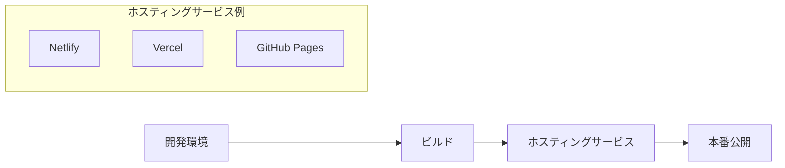

# 🚀 デプロイ入門ガイド

初学者向けに、このサンプルプロジェクトを本番環境にデプロイする基本的な方法を説明します。

## デプロイとは？

**デプロイ**とは、開発したアプリケーションをインターネット上で公開することです。

### このプロジェクトのデプロイ方法



## 基本的なデプロイ手順

### 1. プロジェクトの準備

まず、プロジェクトが正常に動作することを確認します：

```bash
# プロジェクトをビルド
pnpm build

# ビルド結果をプレビュー
pnpm preview
```

### 2. 環境変数の設定

本番環境では環境変数を設定する必要があります：

```bash
# .env.example を参考に本番用設定
NUXT_PUBLIC_API_BASE_URL=https://your-deployed-app.com
```

## Netlifyでのデプロイ

### 🌐 Netlifyとは？

無料で使える静的サイトホスティングサービスです。

### デプロイ手順

#### 1. GitHubにプッシュ

```bash
git add .
git commit -m "Ready for deployment"
git push origin main
```

#### 2. Netlifyでサイト作成

1. [Netlify](https://netlify.com) にアクセス
2. GitHubアカウントでログイン
3. 「New site from Git」をクリック
4. リポジトリを選択

#### 3. ビルド設定

```
Build command: pnpm generate
Publish directory: .output/public
```

#### 4. 環境変数設定

Netlifyダッシュボードで：

- Site settings → Environment variables
- `NUXT_PUBLIC_API_BASE_URL` を設定

## Vercelでのデプロイ

### ⚡ Vercelとは？

Nuxtを開発した会社が提供するホスティングサービスです。

### デプロイ手順

#### 1. Vercel CLIをインストール

```bash
npm i -g vercel
```

#### 2. ログインとデプロイ

```bash
# Vercelにログイン
vercel login

# プロジェクトをデプロイ
vercel

# 本番デプロイ
vercel --prod
```

#### 3. 環境変数設定

```bash
# 環境変数を設定
vercel env add NUXT_PUBLIC_API_BASE_URL
```

## GitHub Pagesでのデプロイ

### 📄 GitHub Pagesとは？

GitHubが提供する無料の静的サイトホスティングです。

### デプロイ手順

#### 1. GitHub Actionsの設定

`.github/workflows/deploy.yml` を作成：

```yaml
name: Deploy to GitHub Pages

on:
  push:
    branches: [main]

jobs:
  deploy:
    runs-on: ubuntu-latest
    steps:
      - uses: actions/checkout@v4

      - name: Setup Node.js
        uses: actions/setup-node@v4
        with:
          node-version: '22'

      - name: Install pnpm
        uses: pnpm/action-setup@v2
        with:
          version: 10

      - name: Install dependencies
        run: pnpm install

      - name: Build
        run: pnpm generate

      - name: Deploy to GitHub Pages
        uses: peaceiris/actions-gh-pages@v3
        with:
          github_token: ${{ secrets.GITHUB_TOKEN }}
          publish_dir: .output/public
```

#### 2. GitHub Pagesを有効化

1. GitHubリポジトリの Settings タブ
2. Pages セクション
3. Source を「GitHub Actions」に設定

## デプロイ後の確認

### ✅ チェックリスト

- [ ] サイトが正常に表示される
- [ ] Health APIが動作する（`/api/swagger` で確認）
- [ ] 環境変数が正しく設定されている
- [ ] エラーがコンソールに出力されていない

### 🔍 トラブル時の確認事項

1. **ビルドエラー**

   ```bash
   # ローカルでビルドテスト
   pnpm build
   ```

2. **環境変数エラー**
   - ホスティングサービスで環境変数が正しく設定されているか確認

3. **API エラー**
   - `/api/swagger` にアクセスしてAPIが動作しているか確認

## 基本的な更新手順

### デプロイ済みサイトの更新

```bash
# 1. 変更をコミット
git add .
git commit -m "Update features"

# 2. GitHubにプッシュ
git push origin main

# 3. 自動デプロイされるのを待つ
# （NetlifyやVercelは自動で再デプロイされます）
```

## 学習のポイント

### 🔰 初学者が覚えること

1. **ビルド**: `pnpm build` でアプリを本番用に準備
2. **環境変数**: 本番とローカルで設定を分ける
3. **自動デプロイ**: GitHubにプッシュすると自動更新

### ⚡ 実践のコツ

- まずローカルでビルドが成功することを確認
- 環境変数は本番用に適切に設定
- エラーが出たらビルドログを確認

## 参考リンク

- [Netlify Documentation](https://docs.netlify.com/)
- [Vercel Documentation](https://vercel.com/docs)
- [GitHub Pages Documentation](https://pages.github.com/)
- [Nuxt Deployment](https://nuxt.com/docs/getting-started/deployment)

## 次のステップ

- 🔧 [トラブルシューティング](./troubleshooting.md) - デプロイエラーの解決
- 💻 [開発ワークフロー](./development.md) - 効率的な開発→デプロイの流れ
- 📊 [状態管理](./state-management.md) - 本番環境での状態管理
