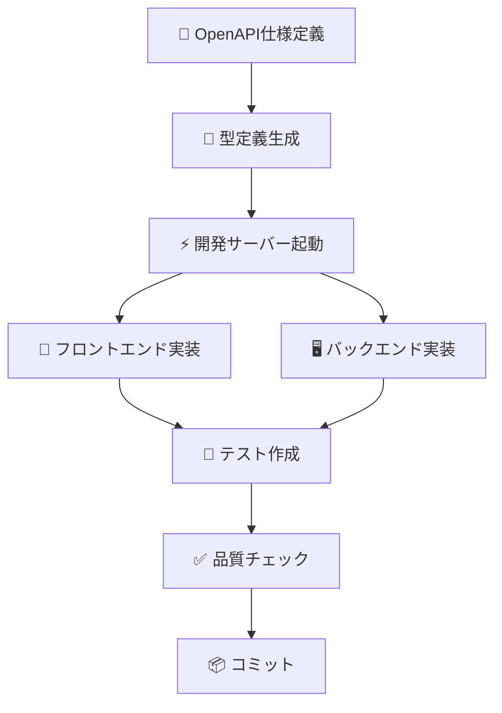

# 💻 開発ワークフローガイド

効率的な開発のためのワークフロー、ツールの使い方、ベストプラクティスについて説明します。

## 基本的な開発フロー

### 1. 新機能開発の標準手順

```bash
# 1. ブランチ作成
git checkout -b feature/new-awesome-feature

# 2. 開発サーバー起動
pnpm dev

# 3. 型定義が必要な場合は生成
pnpm generate-types

# 4. 実装・テスト
# ... コード作成 ...

# 5. コード品質チェック
pnpm lint
pnpm typecheck

# 6. テスト実行
pnpm test

# 7. コミット
git add .
git commit -m "feat: awesome new feature"
```

### 2. API-First開発フロー



#### 具体的な手順

```bash
# 1. API仕様定義
# server/api/schema/ にスキーマ作成

# 2. 型定義生成
pnpm generate-types

# 3. サービス層実装
# app/services/ にAPI通信ロジック

# 4. クエリ層実装
# app/queries/ にTanStack Query統合

# 5. コンポーザブル実装
# app/composables/ に統合ロジック

# 6. コンポーネント実装
# app/components/ にUI実装
```

## 開発ツールとコマンド

### よく使うコマンド一覧

```bash
# 🚀 開発関連
pnpm dev              # 開発サーバー起動
pnpm build            # プロダクションビルド
pnpm preview          # ビルド結果プレビュー
pnpm generate         # 静的サイト生成

# 📊 型・API関連
pnpm generate-types   # API型定義生成
pnpm typecheck        # TypeScript型チェック

# 🔍 コード品質
pnpm lint             # 全リンター実行
pnpm lint:fix         # 自動修正付きリント
pnpm eslint           # ESLintのみ
pnpm eslint:fix       # ESLint自動修正
pnpm biome            # Biomeのみ
pnpm biome:fix        # Biome自動修正
pnpm prettier         # Prettierのみ
pnpm prettier:fix     # Prettier自動修正

# 🧪 テスト関連
pnpm test             # テスト実行
pnpm test:watch       # ウォッチモード
pnpm test:coverage    # カバレッジ付きテスト
```

### 効率的な開発のためのコンビネーション

```bash
# 同時実行で効率化
pnpm dev & pnpm test:watch    # 開発 + テスト監視

# 品質チェック一括実行
pnpm lint && pnpm typecheck && pnpm test
```

## プロジェクト構造とファイル配置

### 新しいページ追加

```bash
# ファイル作成
touch app/pages/about.vue

# 自動的にルート /about が作成される
```

```vue
<!-- app/pages/about.vue -->
<template>
  <div>
    <h1>About Page</h1>
    <p>このページについて</p>
  </div>
</template>
```

### 新しいAPI追加

```typescript
// 1. スキーマ定義
// server/api/schema/products.ts
export const getProductsRoute = createRoute({
  method: 'get',
  path: '/products',
  responses: {
    200: {
      content: {
        'application/json': {
          schema: ProductsResponseSchema,
        },
      },
      description: 'Products list',
    },
  },
});

// 2. ルート実装
// server/api/routes/products.ts
app.openapi(getProductsRoute, (c) => {
  return c.json({ products: [] });
});

// 3. 型定義生成
// pnpm generate-types

// 4. サービス作成
// app/services/products.ts
export const getProductsApi = async () => {
  const response = await $fetch('/api/products');
  return zGetApiProductsResponse.parse(response);
};

// 5. クエリ作成
// app/queries/useProductsQuery.ts
export const useProductsQuery = () => {
  return useQuery({
    queryKey: ['products'],
    queryFn: getProductsApi,
  });
};
```

### 新しい機能追加（状態管理込み）

```typescript
// 1. Piniaストア（クライアント状態）
// app/store/products.ts
export const useProductsStore = defineStore('products', () => {
  const filters = ref({ category: 'all' });
  const searchQuery = ref('');

  return { filters, searchQuery };
});

// 2. サーバー状態アダプター
// app/composables/useProducts/useProductsAdapter.ts
export const useProductsAdapter = () => {
  const { data, isLoading } = useProductsQuery();

  const products = computed(() => data.value?.products ?? []);

  return { products, isLoading };
};

// 3. クライアント状態アダプター
// app/composables/useProducts/useProductsFilters.ts
export const useProductsFilters = () => {
  const store = useProductsStore();
  const { filters, searchQuery } = storeToRefs(store);

  return { filters, searchQuery };
};

// 4. 統合コンポーザブル
// app/composables/useProducts/index.ts
export const useProducts = () => {
  return {
    ...useProductsAdapter(), // サーバー状態
    ...useProductsFilters(), // クライアント状態
  };
};
```

## コード品質の保持

### リンター・フォーマッター設定

このプロジェクトでは3つのツールを組み合わせて使用：

- **Biome**: 高速リンター・フォーマッター
- **ESLint**: JavaScript/TypeScript静的解析
- **Prettier**: コードフォーマッター

### 設定ファイル

```typescript
// biome.json
{
  "$schema": "https://biomejs.dev/schemas/1.9.4/schema.json",
  "vcs": { "enabled": false, "clientKind": "git", "useIgnoreFile": false },
  "files": { "ignoreUnknown": false, "ignore": [] },
  "formatter": {
    "enabled": true,
    "indentStyle": "space"
  },
  "organizeImports": { "enabled": true },
  "linter": {
    "enabled": true,
    "rules": {
      "recommended": false
    }
  }
}
```

### VS Code設定

```json
// .vscode/settings.json
{
  "editor.codeActionsOnSave": {
    "source.fixAll.eslint": true,
    "source.organizeImports.biome": true
  },
  "editor.formatOnSave": true,
  "[typescript]": {
    "editor.defaultFormatter": "biomejs.biome"
  },
  "[vue]": {
    "editor.defaultFormatter": "Vue.volar"
  }
}
```

### Git Hooks

```bash
# .husky/pre-commit
#!/usr/bin/env sh
. "$(dirname -- "$0")/_/husky.sh"

pnpm lint
pnpm typecheck
```

## デバッグ手法

### 1. ブラウザ開発者ツール

```typescript
// コンソールでの状態確認
console.log('Current state:', {
  serverState: data.value,
  clientState: input.value,
  loading: isLoading.value,
});
```

### 2. Vue DevTools

- コンポーネント構造の確認
- リアクティブデータの監視
- Piniaストアの状態確認

### 3. TanStack Query DevTools

```typescript
// app/plugins/vue-query.ts
import { VueQueryDevtools } from '@tanstack/vue-query-devtools';

export default defineNuxtPlugin((nuxtApp) => {
  // 開発環境のみDevToolsを有効化
  if (process.env.NODE_ENV === 'development') {
    nuxtApp.vueApp.use(VueQueryDevtools);
  }
});
```

### 4. ネットワーク監視

```typescript
// 開発中のAPI通信ログ
const getHealthApi = async () => {
  console.log('API Request: /api/health');
  const response = await $fetch('/api/health');
  console.log('API Response:', response);
  return response;
};
```

## パフォーマンス最適化

### ビルド最適化

```typescript
// nuxt.config.ts
export default defineNuxtConfig({
  nitro: {
    minify: true,
  },
  css: {
    preprocessorOptions: {
      scss: {
        additionalData: `@import "~/assets/css/variables.scss";`,
      },
    },
  },
  vite: {
    build: {
      rollupOptions: {
        output: {
          manualChunks: {
            vendor: ['vue', 'vue-router'],
            tanstack: ['@tanstack/vue-query'],
          },
        },
      },
    },
  },
});
```

### コンポーネント最適化

```vue
<!-- 重いコンポーネントの遅延読み込み -->
<script setup lang="ts">
const HeavyComponent = defineAsyncComponent(() => import('~/components/HeavyComponent.vue'));
</script>

<template>
  <div>
    <Suspense>
      <HeavyComponent />
      <template #fallback>
        <div>Loading...</div>
      </template>
    </Suspense>
  </div>
</template>
```

## 環境設定

### 環境変数管理

```bash
# .env.example
NUXT_PUBLIC_API_BASE_URL=http://localhost:3000
DATABASE_URL=sqlite://./database.db
API_SECRET_KEY=your-secret-key
```

```typescript
// app/composables/useEnv.ts
export const useEnv = () => {
  const runtimeConfig = useRuntimeConfig();

  return {
    apiBaseUrl: runtimeConfig.public.apiBaseUrl,
    isDevelopment: process.env.NODE_ENV === 'development',
  };
};
```

### 本番環境向け設定

```typescript
// nuxt.config.ts
export default defineNuxtConfig({
  runtimeConfig: {
    // Private keys (only available on server-side)
    apiSecret: process.env.API_SECRET_KEY,

    // Public keys (exposed to client-side)
    public: {
      apiBaseUrl: process.env.NUXT_PUBLIC_API_BASE_URL,
    },
  },
});
```

## チーム開発のベストプラクティス

### コミット規約

```bash
# 新機能
git commit -m "feat: ユーザー認証機能を追加"

# バグ修正
git commit -m "fix: ログイン時のエラーハンドリングを修正"

# ドキュメント更新
git commit -m "docs: APIドキュメントを更新"

# リファクタリング
git commit -m "refactor: 状態管理ロジックを整理"

# テスト追加
git commit -m "test: ユーザー認証のテストを追加"
```

### ブランチ戦略

```bash
main          # 本番環境用
├── develop   # 開発統合用
│   ├── feature/user-auth       # 機能開発
│   ├── feature/product-catalog # 機能開発
│   └── bugfix/login-error     # バグ修正
└── hotfix/critical-bug        # 緊急修正
```

### コードレビューのポイント

- **型安全性**: 適切な型定義が使用されているか
- **状態分離**: サーバー状態とクライアント状態が適切に分離されているか
- **パフォーマンス**: 不要な再レンダリングやAPI呼び出しがないか
- **テスト**: 適切なテストが書かれているか
- **エラーハンドリング**: エラー処理が適切に実装されているか

## 次のステップ

- 🧪 [テスト戦略](./testing.md)
- 🔧 [トラブルシューティング](./troubleshooting.md)
- 🚀 [本番デプロイ](./deployment.md)
